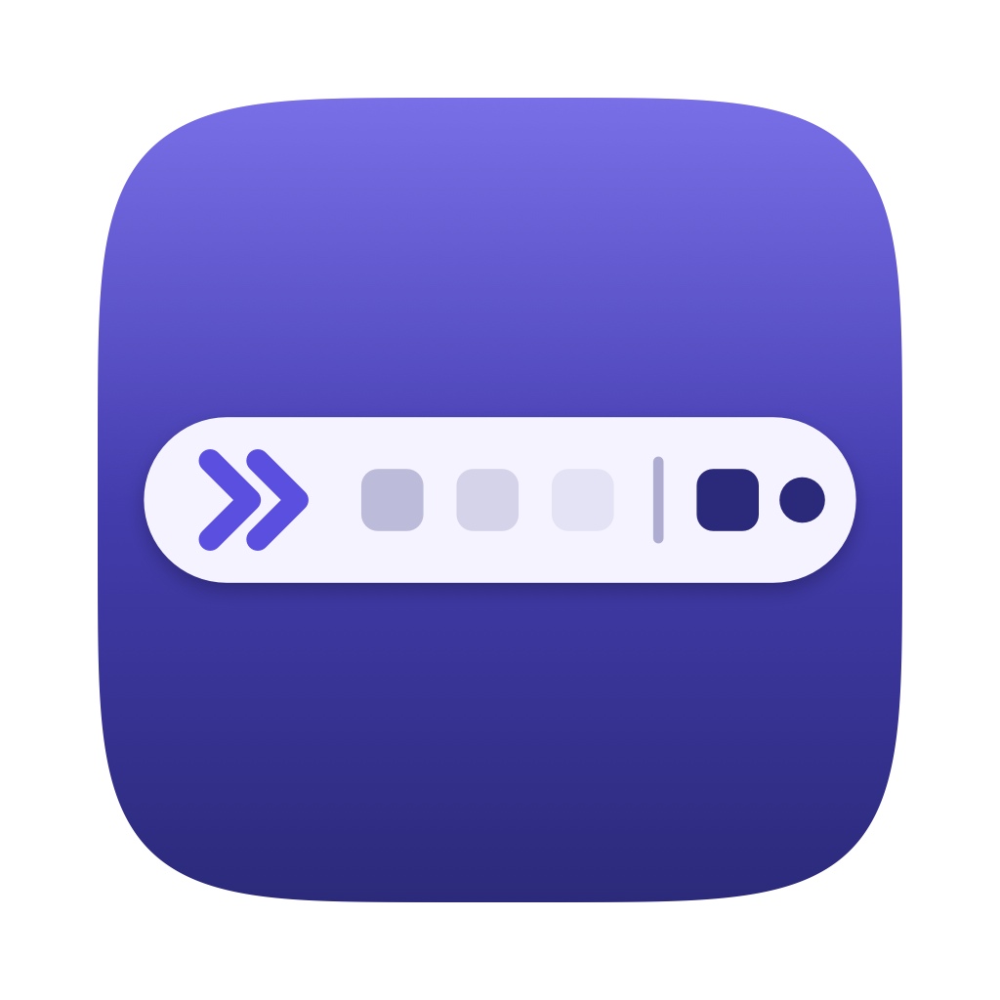

<p align="center"></p>

<h1 align="center">IconCloak</h1>

Hide menu bar icons on macOS 27. A small, open-source take on
[Vanilla](https://matthewpalmer.net/vanilla/), which stopped working on macOS 27.

<p align="center"></p>

> **Status: early prototype.** It works day to day on a MacBook with a notch running
> macOS 27, but it hasn't been tested on other setups yet (see [Limitations](#limitations)).

## What it does

- **Collapse:** click `»` (or press **⌃⌥⌘H**) and the icons you chose disappear.
  Only macOS's own `«` button stays in the menu bar.
- **Expand:** click `«` (or press **⌃⌥⌘H** again) and they come back.
- **Choose what to hide:** when expanded, IconCloak shows `»` on the left and a `|` marker.
  The icons between them get hidden. Hold **⌘** and drag icons in or out.
- **Auto-hide (optional):** hide the icons again a set number of seconds after expanding.
  It waits while your pointer is on the menu bar or a menu is open.
- **Settings:** auto-hide, your own keyboard shortcut and launch at login, in one window.
- **Stays hidden when you switch apps.** IconCloak adapts to each app's menus, so hidden
  icons don't reappear next to short menus like Finder's.

## Install

The [install guide](docs/install.md) has step-by-step instructions, updating, uninstalling
and troubleshooting. The short version:

### Download

1. Download `IconCloak-<version>.zip` from the
   [latest release](https://github.com/LarsAtassi/icon-cloak/releases/latest) and unzip it.
2. Move **IconCloak.app** to your **Applications** folder.
3. Open it. IconCloak isn't notarized by Apple (that needs a paid developer account), so
   macOS blocks it the first time. Go to **System Settings → Privacy & Security**, scroll
   down and click **Open Anyway**.
4. Grant **Accessibility** when asked: System Settings → Privacy & Security →
   Accessibility → IconCloak. IconCloak picks it up within a couple of seconds.
5. Optional: right-click `»` → **Launch at Login**.

Every release is signed with the same certificate, so the Accessibility permission carries
over when you update. Just replace the app in Applications.

### Build from source

You need macOS 27 and the Xcode Command Line Tools (`xcode-select --install`).

```bash
git clone https://github.com/LarsAtassi/icon-cloak.git
cd icon-cloak
scripts/create-dev-cert.sh     # optional, see below
scripts/build-app.sh --install # builds and copies it to /Applications
```

On first launch, macOS asks for the **Accessibility** permission. Grant it in
System Settings → Privacy & Security → Accessibility to **/Applications/IconCloak.app**.
IconCloak picks up the permission within a couple of seconds, without a restart.

Grant it to the copy in `/Applications`, not to `build/IconCloak.app`. macOS can mix up
entries that point at the same build folder, and the switch then has no effect.

`create-dev-cert.sh` creates a self-signed "IconCloak Dev" signing certificate in your
login keychain. It's optional, but without it macOS forgets the Accessibility permission
every time you rebuild. You can delete the certificate anytime in Keychain Access.

## Usage

| Action | How |
|---|---|
| Hide icons | Click `»`, or ⌃⌥⌘H |
| Show icons | Click `«`, or ⌃⌥⌘H |
| Choose which icons hide | Hold ⌘ and drag icons between `»` and `\|` |
| Settings (auto-hide, shortcut, launch at login) | Right-click `»` → Settings… |

`»` always stays in front of the leftmost icon. If you drag an icon to its left, IconCloak
moves `»` back in front, so that icon joins the hidden ones. It does this with a quick
simulated ⌘-drag (also once at launch) and puts your mouse pointer back afterwards.

## Permissions and privacy

IconCloak needs **Accessibility** to:

- read where the frontmost app's menus end, so it can size the space it reserves,
- catch clicks on the `«` button.

It doesn't use the network and doesn't collect anything. It keeps a small log of layout
events at `~/Library/Logs/IconCloak.log`, which is cleared once it passes 1 MB.

## How it works

On macOS 27, the system process `MenuBarAgent` draws all menu bar icons and lays them out
in this order: right of the notch, then left of the notch after the app menus, and only
then in its own `«` overflow. When collapsing, IconCloak widens its `»` and `|` items to
fill the free space on both sides of the notch. The icons you chose then fit nowhere, and
macOS moves them into its overflow.

The full write-up, including what didn't work, is in [docs/how-it-works.md](docs/how-it-works.md).

## Limitations

- Tested on a MacBook with a notch and on external displays without one. With several
  displays, hiding is set up for the display your pointer is on, and adjusts when you move
  to another one.
- On displays without a notch, macOS puts its `«` near the middle of the menu bar, so
  IconCloak adds its own `«` next to your visible icons.
- No settings window yet. Everything is in the right-click menu.
- It relies on how macOS 27 lays out the menu bar, which isn't a public API. A macOS update
  may break it.

## Development

```bash
scripts/build-app.sh --dev --install   # adds remote test controls and build/ctl
build/ctl collapse                     # also: expand, log, axdump, pressoverflow, click:x,y
```

Dev builds accept commands from any local process, and IconCloak has the Accessibility
permission. **Don't use `--dev` builds day to day or distribute them.**

To make a release, bump `CFBundleShortVersionString` in `scripts/build-app.sh`, then run
`scripts/release.sh`. It builds `build/IconCloak-<version>.zip` plus a checksum and refuses to
package dev builds or builds not signed with the "IconCloak Dev" certificate. Always sign
releases with the same certificate, so users keep their Accessibility permission when they
update.

The app icon is drawn by [scripts/make-icon.swift](scripts/make-icon.swift). Run it to
regenerate `Resources/AppIcon.icns` after changing it.

The code is in [Sources/IconCloak/main.swift](Sources/IconCloak/main.swift). Issues and
pull requests are welcome, especially reports from setups other than a notched MacBook.

## Acknowledgements

Inspired by [Vanilla](https://matthewpalmer.net/vanilla/) by Matthew Palmer. IconCloak is
an independent project and is not affiliated with Vanilla. See also
[Ice](https://github.com/jordanbaird/Ice) and [Hidden Bar](https://github.com/dwarvesf/hidden).

## License

[MIT](LICENSE)
